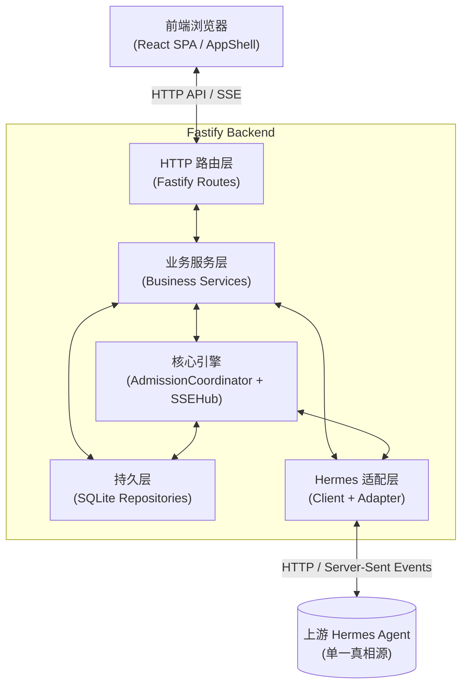
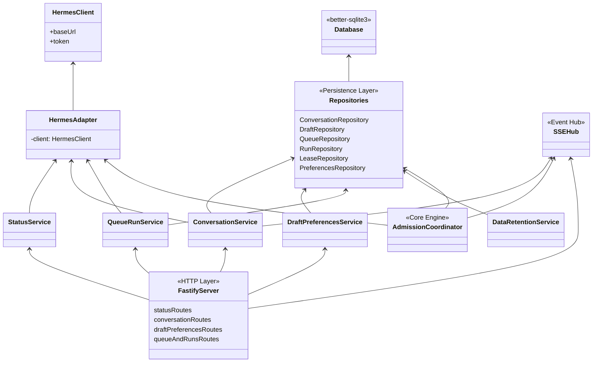
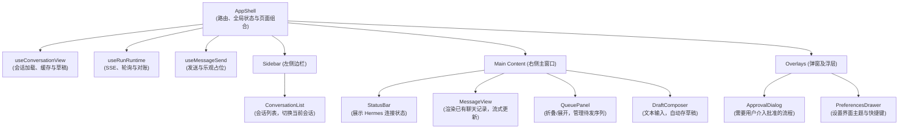

# emu-chat 架构设计

## 1. 整体分层架构

emu-chat 采用了清晰的分层架构，将前端浏览器交互与底层外部系统集成隔离开来。后端架构分为：HTTP路由层、业务服务层、核心引擎层、持久层，以及专门的 Hermes 适配层。

## 2. 服务端组件依赖关系

服务端基于依赖注入（Dependency Injection）理念设计，核心组装过程发生在 `app.ts` (`buildServer` 函数) 中。下方的类图展示了服务启动时的组件织入关系：

## 3. 层级职责说明

### HTTP 路由层
负责接收外部 HTTP 请求，进行 Schema 校验（Zod），并将请求委派给业务服务层处理。路由被拆分在四个命名空间：
- `conversations.ts`: 处理会话和消息的历史获取及列表操作。
- `drafts-and-preferences.ts`: 管理本地的草稿保存和用户 UI 偏好。
- `queue-and-runs.ts`: 接收用户发送的消息，排入队列并触发运行状态机；提供 SSE 路由。
- `status.ts`: 探测后端的运行状态及上游 Hermes 的连通性。

### 业务服务层
聚合仓储和适配器逻辑，执行具体业务：
- `ConversationService`: 同步及处理会话列表，从 Hermes 获取最新消息内容。
- `DraftPreferencesService`: 本地状态数据的存取。
- `QueueRunService`: 处理复杂的消息发送、队列调度，并协调任务的唤醒机制。
- `StatusService`: 面向前端提供服务健康指标检查。

### 核心引擎
控制应用的后台处理节奏和实时事件分发：
- **AdmissionCoordinator（准入协调器）**: 后台任务引擎，处理队列的进出逻辑，管理 Lease（租约）防止并发竞争，并与 Hermes 同步任务执行状态。
- **SSEHub（事件广播中枢）**: 接收协调器发布的 Run 事件，维护浏览器 SSE 连接和内存中的短期回放窗口，向前端广播状态变更与 Token 流；Run 事件序号写入数据库，事件内容不持久化。

### 持久层 (SQLite 仓储)
由 6 个仓储类构成：
- `ConversationRepository`: 本地会话的元数据缓存。
- `DraftRepository`: 尚未发送的草稿内容。
- `PreferencesRepository`: 存储用户的个性化配置。
- `QueueRepository`: 待发送或排队中的请求序列。
- `RunRepository` 与 `LeaseRepository`: 本地任务运行和并发锁的信息。

`DataRetentionService` 在服务启动及此后每分钟分批清理过期恢复正文和终态控制记录，不负责压缩 SQLite 文件。

### Hermes 集成层
与上游交互的核心：
- `HermesClient`: 基于原生 Fetch、逐行 SSE 解析和超时控制实现的上游 HTTP/SSE 客户端。
- `HermesAdapter`: 进行协议级的适配，处理数据转换与异常包装。
- `capabilities.ts`: 在连接时进行能力协商，确保 Hermes 支持必要功能。

## 4. 前端组件架构

前端采用单页应用设计。`AppShell` 负责路由、全局状态和布局组合；会话视图、Run 生命周期及发送过程由各自的状态 Hook 管理：

## 5. 前后端共享层 (`src/shared/`)

前后端共同使用 `src/shared/` 中的类型和 Schema，减少接口约定漂移。主要作用包括：
- **Zod Schema**: 服务端路由使用共享 Schema 校验请求参数和请求体；共享响应 Schema 提供 TypeScript 类型。客户端当前按类型读取响应 JSON，没有对响应再做运行时 Schema 校验。
- **共享枚举**: API 的错误码定义、状态机的枚举值。
- **ID 生成**: `ids.ts` 提供带前缀的服务端资源 ID；Fastify 的 `genReqId` 使用它生成或验证 `rq_` 请求 ID。
- **限制常量**: `LIMITS` 统一约定单活跃 Run、内容、队列、分页、租约和超时上限。

## 6. Fastify 服务生命周期

服务端的启动及停机采用了优雅的生命周期管理：
1. **启动与组装 (`app.ts`)**: 注入所有的 Repository 和外部 Client。
2. **路由注册**: 启动 `AdmissionCoordinator`，绑定所有的 Fastify Route 及其前缀。
3. **优雅停机 (Graceful Shutdown)**:
   - `preClose` 钩子：停止协调器和数据保留定时器，再关闭 SSE 连接。
   - `onClose` 钩子：最终释放数据库连接 `db.close()`。

## 7. 请求 ID 链路追踪

为了易于诊断异常，整个系统严格贯穿了请求追踪机制：
- 使用 Fastify 提供的 `genReqId` 定制逻辑：仅保留符合 `rq_` 格式的 `x-request-id`；未传或无效时自动生成新 ID。
- 在服务端的异常捕获中间件 (`setErrorHandler`) 及正常的响应流程中 (`onSend`)，均会将该 `rq_` ID 加入头部 `x-request-id` 返回给客户端。
- 在内部的服务日志 `logger` 输出中，每条重要的业务或异常日志均绑定相应的 `requestId` 上下文。
