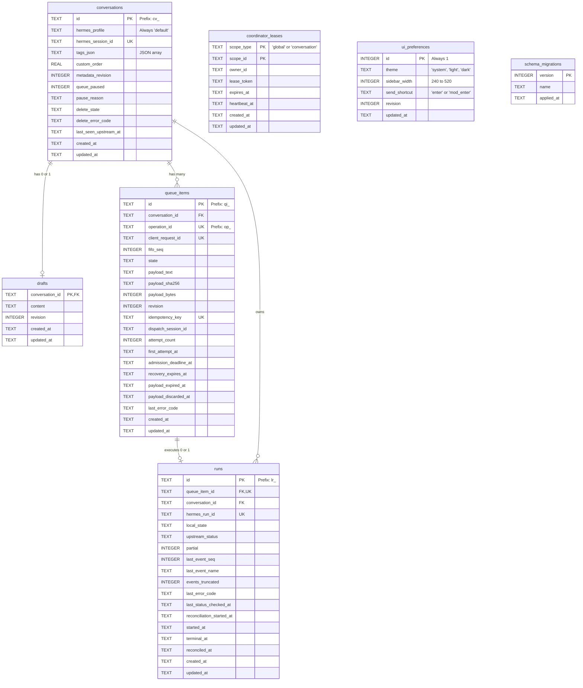

# 数据模型与数据库设计 (Data Model)

本文档详细描述了 `emu-chat` 项目的核心数据库设计，包括 SQLite 调优、表结构、约束和事务处理机制。

## 1. SQLite 连接初始化与 PRAGMA 调优

数据库连接的初始化位于 [connection.ts](../src/server/db/connection.ts) 中。为应对高并发读取和可靠写入，采用了以下核心 PRAGMA 配置：

- **`journal_mode = WAL`**：开启 Write-Ahead Logging。极大提升读写并发性，允许读写操作同时进行，显著减少锁定冲突。
- **`foreign_keys = ON`**：启用外键约束，保证层级数据（如 `conversations` 到 `queue_items`、`runs` 等）的引用完整性。
- **`synchronous = NORMAL`**：在 WAL 模式下，将同步级别降为 `NORMAL`。在保证较好崩溃恢复能力的同时，避免了每次提交都强制落盘带来的性能损耗。
- **`busy_timeout = 5000`**：设置 5 秒的重试超时时间。当遇到写锁冲突时，SQLite 会自动等待和重试，减少直接抛出 `SQLITE_BUSY` 错误的频率。

## 2. 迁移机制 (Migrations)

迁移系统位于 [migrate.ts](../src/server/db/migrate.ts)。在每次服务启动时，`runMigrations` 函数会自动执行以下步骤：
1. 确保 `schema_migrations` 表存在，并读取已应用的迁移版本。
2. 扫描 `migrations/` 目录下的所有 `.sql` 文件。
3. 按照文件名前缀的版本号（如 `0001_initial.sql`）进行排序。
4. 对未应用的脚本包裹在一个原子事务中执行，完成后写入新的版本记录。

## 3. 实体关系图 (ER Diagram)

下面是系统中 7 张核心数据表的完整 ER 图表示。



## 4. 表结构与字段说明

### 4.1 `schema_migrations`
记录数据库的迁移历史。
- **version**: (INTEGER) 迁移脚本的版本号，主键。
- **name**: (TEXT) 迁移的名称。
- **applied_at**: (TEXT) 应用时间。

### 4.2 `conversations`
表示一个用户会话（聊天记录与配置容器）。
- **id**: (TEXT) 主键，必须以 `cv_` 开头。
- **hermes_profile**: (TEXT) 默认 `'default'`。
- **hermes_session_id**: (TEXT) 上游 Hermes 服务的会话标识，全局唯一。
- **tags_json**: (TEXT) JSON 数组字符串，记录会话标签。
- **custom_order**: (REAL) 允许用户自定义排序。
- **metadata_revision**: (INTEGER) 乐观锁版本号，控制会话元数据并发修改。
- **queue_paused**: (INTEGER) `0` 或 `1`，标记该会话的队列是否暂停。
- **pause_reason**: (TEXT) 暂停的枚举原因，如 `run_failed`。若 `queue_paused = 1` 则必填。
- **delete_state**: (TEXT) 会话软删状态，`none`, `pending`, `failed`。
- **delete_error_code**: (TEXT) 删除失败的错误码。
- **last_seen_upstream_at**: (TEXT) 上游最后活跃时间。
- **created_at**, **updated_at**: 审计时间戳。

### 4.3 `drafts`
存储用户的输入草稿。
- **conversation_id**: (TEXT) 关联 `conversations` 主键。
- **content**: (TEXT) 草稿内容。
- **revision**: (INTEGER) 用于并发冲突解决的乐观锁版本。

### 4.4 `queue_items`
会话中的操作请求排队记录。
- **id**: (TEXT) 主键，必须以 `qi_` 开头。
- **conversation_id**: (TEXT) 外键，关联所属会话。
- **operation_id**: (TEXT) 操作 ID，以 `op_` 开头，唯一约束。
- **client_request_id**: (TEXT) 客户端生成的请求 ID，唯一约束防重。
- **fifo_seq**: (INTEGER) 先进先出序列号，控制同一会话内队列项的处理顺序。
- **state**: (TEXT) 队列项的当前状态（如 `queued`, `dispatching` 等，详见状态机文档）。
- **payload_text**: (TEXT) 完整的请求载荷内容。处理完成、取消或恢复期满后会被清空（置 NULL），释放数据库内可复用空间，但不保证数据库文件立即缩小。
- **payload_sha256**, **payload_bytes**: 用于验证载荷完整性和限制大小。
- **revision**: (INTEGER) 队列项的乐观锁版本。
- **idempotency_key**: (TEXT) 幂等键，通常带有前缀 `ec_`。
- **dispatch_session_id**: (TEXT) 分发给运行器处理时的当前派发会话标识。
- **attempt_count**: (INTEGER) 失败重试次数，限制在 0-4 次。
- **first_attempt_at**, **admission_deadline_at**: 用于控制准入与重试的时间戳。
- **recovery_expires_at**: 失败项恢复正文的 7 天截止时间；**payload_expired_at** 记录到期清理时的原截止时间，**payload_discarded_at** 记录用户主动丢弃正文的时间。
- **last_error_code**: (TEXT) 最后一次失败原因。

### 4.5 `runs`
对应上游 Hermes 的一次实际运行记录。
- **id**: (TEXT) 本地 Run ID，必须以 `lr_` 开头。
- **queue_item_id**: (TEXT) 所属队列项，一对一映射，唯一外键。
- **conversation_id**: (TEXT) 冗余外键，便于快速按会话查询，级联删除。
- **hermes_run_id**: (TEXT) 上游 Hermes 分配的 Run ID。必须唯一。
- **local_state**: (TEXT) 本地轮询/同步状态。
- **upstream_status**: (TEXT) 上游 Hermes 传回的状态同步值。
- **partial**: (INTEGER) 布尔型，标记本次运行是否部分完成。
- **last_event_seq**: (INTEGER) 流式事件的最新序号，防乱序。
- **last_event_name**: (TEXT) 最后一个处理的 SSE 事件名。
- **events_truncated**: (INTEGER) 事件流是否被截断。
- **last_error_code**: (TEXT) 如果失败，记录错误码。
- **last_status_checked_at**, **reconciliation_started_at**, **started_at**, **terminal_at**, **reconciled_at**: Run 生命周期的各个阶段时间戳。

### 4.6 `coordinator_leases`
系统协调器用于保证集群或单实例中唯一的角色分配（如单会话仅一个活跃处理任务）。
- **scope_type**: (TEXT) 作用域范围，`global` 或 `conversation`。
- **scope_id**: (TEXT) 如果是 `conversation` 则为 `cv_`，否则为 `global`。
- **owner_id**: (TEXT) 占用该锁的所有者 ID。
- **lease_token**: (TEXT) 随机生成的防篡改校验令牌。
- **expires_at**, **heartbeat_at**: 租约过期和心跳时间戳，到期后其他 worker 可抢占。

### 4.7 `ui_preferences`
单行表，用于保存系统 UI 全局偏好配置。
- **id**: (INTEGER) 固定为 1。
- **theme**: 主题（system/light/dark）。
- **sidebar_width**: 侧边栏宽度（240-520）。
- **send_shortcut**: 发送快捷键，如 `enter`。
- **revision**: 用于更新的乐观锁。

---

## 5. 关键 CHECK 约束详解

数据库层使用 `CHECK` 约束深度绑定了状态机的边界条件，阻止脏数据落盘。

### 5.1 `queue_items` 的 CHECK 约束
```sql
  CHECK (state <> 'queued' OR dispatch_session_id IS NULL),
  CHECK (state NOT IN ('dispatching', 'accepted', 'reconciling', 'done', 'paused')
         OR dispatch_session_id IS NOT NULL),
  CHECK (state NOT IN ('queued', 'dispatching', 'accepted', 'reconciling')
         OR payload_text IS NOT NULL),
  CHECK (state NOT IN ('done', 'cancelled') OR payload_text IS NULL)
```
- **意图解释**：
  1. `queued` 态一定不能分配 `dispatch_session_id`。
  2. 进入 `dispatching` 和活跃执行期时，必须有明确的 `dispatch_session_id`，用于绑定处理者并防脑裂。
  3. 当处于排队或活跃状态 (`queued` 到 `reconciling`) 时，**必须持有** `payload_text` 才能发起请求。
  4. 当到达终态 (`done`, `cancelled`) 时，**必须清理** `payload_text` (置为 NULL)，避免冗长载荷长期占据 SQLite 页面，造成数据库膨胀。

### 5.2 `runs` 的 CHECK 约束
```sql
  CHECK (local_state NOT IN ('accepted', 'reconciling', 'reconciled')
         OR hermes_run_id IS NOT NULL),
  CHECK (local_state NOT IN ('submitting', 'rejected')
         OR hermes_run_id IS NULL),
  CHECK (hermes_run_id IS NOT NULL OR upstream_status IS NULL)
```
- **意图解释**：
  1. 如果本地状态已经脱离正在提交，到达被接受之后的阶段，则必须拿到上游的 `hermes_run_id`。
  2. 如果还在 `submitting`（正在提交）或者被拒绝 `rejected`，一定尚未拿到合法的上游 ID。
  3. 没有获取到上游 `hermes_run_id` 之前，不可以拥有任何 `upstream_status` 状态缓存。

## 6. 关键索引设计

系统核心业务依赖于队列严格按照 FIFO，且保证并发安全。

1. **`ux_queue_one_global_active`**:
   - `CREATE UNIQUE INDEX ... ON queue_items ((1)) WHERE state IN ('dispatching', 'accepted', 'reconciling')`
   - **作用**：通过对常量 `(1)` 建立条件唯一索引，在整个 SQLite 数据库中，强制系统内**只能同时存在 1 个**处于上述活跃处理状态的 `queue_items`，实现了物理级别的“全局单活跃”隔离。
2. **`ux_queue_one_conversation_active`**:
   - `CREATE UNIQUE INDEX ... ON queue_items (conversation_id) WHERE state IN (...)`
   - **作用**：类似地，针对单会话粒度的队列，同一个 `conversation_id` 只能有一个活跃的排队项正在被分发和执行。
3. **`ix_queue_fifo`**:
   - `CREATE INDEX ... ON queue_items (conversation_id, state, fifo_seq)`
   - **作用**：优化队列轮询。让协程能够极快地通过 `conversation_id` 找到特定 `state`（如 `queued`）下，按 `fifo_seq` 排序最前面的待处理项，加速出队操作。
4. **`ix_queue_recovery_expiry`**:
   - `CREATE INDEX ... ON queue_items (recovery_expires_at) WHERE payload_text IS NOT NULL ...`
   - **作用**：支持后台清理进程快速找出已过期但载荷尚未清理的僵尸项进行释放。
5. **`ix_queue_control_retention`**:
   - `CREATE INDEX ... ON queue_items (updated_at) WHERE state IN ('done', 'cancelled', 'paused', 'rejected')`
   - **作用**：支持按保留期限分批删除已终结且不再需要恢复正文的本地控制记录。

## 7. ID 前缀规范

为便于排查日志和分辨实体关系，统一要求主键和关键字段携带前缀：
- **`cv_`**：Conversations（会话 ID）
- **`qi_`**：QueueItems（队列项 ID）
- **`op_`**：Operations（前端和 Hermes 间的通用操作 ID）
- **`lr_`**：Local Runs（本地 Run ID）
- **`rq_`**：Client Requests（客户端 HTTP 请求 ID，多为无前缀 uuid 但在架构上区分）
- **`ec_`**：Idempotency Keys（执行幂等键）

## 8. 乐观锁 (Revision) 机制

在 `conversations.metadata_revision`, `drafts.revision`, `queue_items.revision`, `ui_preferences.revision` 等表中广泛应用了乐观锁设计：
- 每次更新数据时，带有 `SET revision = revision + 1 WHERE id = ? AND revision = ?`。
- 如果受影响行数(changes)为 0，则抛出更新冲突(Conflict)异常。这在多标签页同时修改草稿或并发暂停队列时尤为重要。

## 9. `withImmediateTransaction` 的设计

参见 [transaction.ts](../src/server/db/transaction.ts)。
- **排他写锁 (BEGIN IMMEDIATE)**：标准 SQLite 的 `BEGIN` 是延迟获取写锁。使用 `BEGIN IMMEDIATE` 强制立即获取保留锁(Reserved Lock)，从而避免并发写引发的死锁问题，与 `busy_timeout` 完美配合。
- **防嵌套重入**：函数内部使用 `db.inTransaction` 检测，如果有上层事务已开启，则复用外部事务，不会报错。
- **容错回滚**：当业务逻辑抛出异常时，利用 `finally/catch` 确保安全的 `ROLLBACK`，不会在数据库连接池中留下未封闭的损坏事务上下文。
