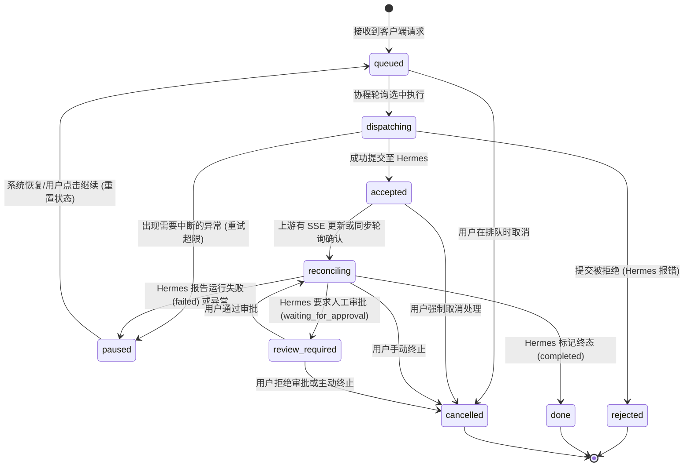
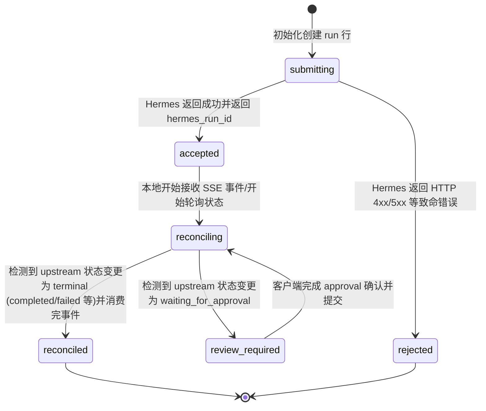
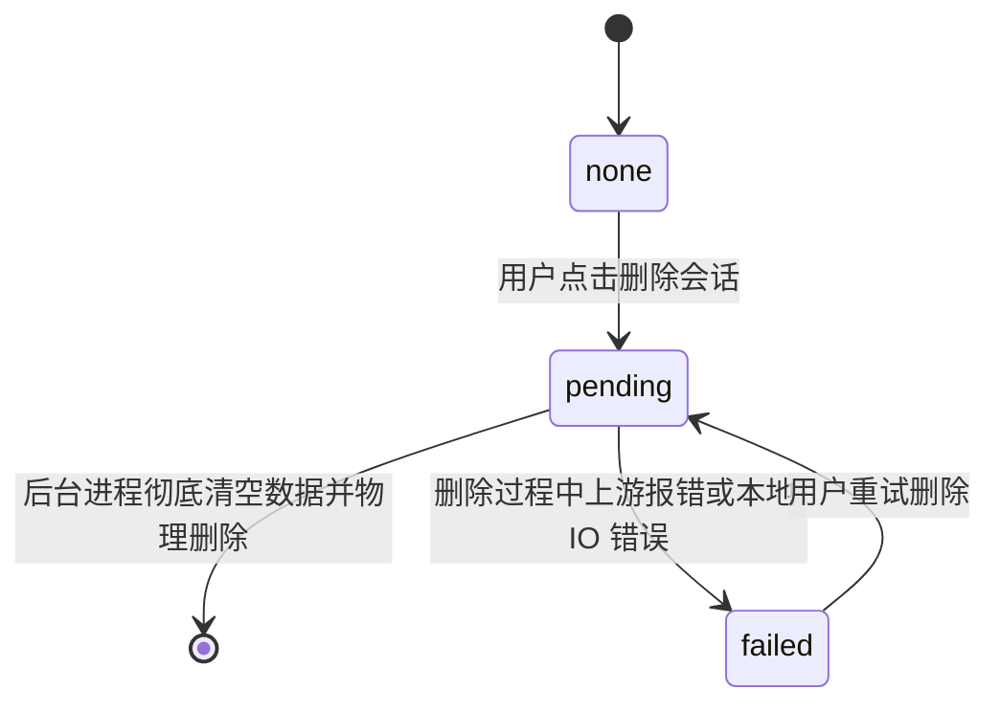

# 状态机机制 (State Machines)

本文档描述 `emu-chat` 系统中各个核心生命周期的流转与状态管理。系统高度依赖状态机确保前后端状态一致性，并通过 SQLite 层面提供严格校验。

## 1. 队列项状态 (QueueItemState)

`queue_items` 表控制每一个用户操作(Operation)在后端的生命周期。

*共有 9 种状态，确保请求从排队、提交到执行监听的严密闭环。*

## 2. 本地 Run 状态 (RunLocalState)

当 `queue_items` 进入分发态时，会在 `runs` 表中创建一行。它负责追踪单次与上游交互的具体进度。

## 3. 上游 Run 状态 (UpstreamRunStatus)

此状态为 Hermes 上游返回的状态映射，直接缓存于 `runs.upstream_status` 字段中：
1. **queued**: 任务已被 Hermes 接收，处于远端排队。
2. **running**: 模型或工具正在执行。
3. **waiting_for_approval**: 工具调用需要用户人工确认。
4. **stopping**: 用户请求停止，正在安全中止流。
5. **completed**: 正常处理完成，拿到全部结果。
6. **failed**: 执行遇到系统或模型错误崩溃。
7. **cancelled**: 被主动完全取消。
8. **interrupted**: 被异常中断（如节点重启等）。

## 4. 会话删除状态 (DeleteState)

管理会话的软删除和异步清空过程。

## 5. 连接状态 (ConnectionStatusHermes)

用于 SSE 和前端状态栏显示的全局 Hermes 可用性：
1. **checking**: 正在探测上游健康接口。
2. **healthy**: 连接正常，版本和鉴权均通过。
3. **degraded**: 能连接但部分能力受限或延迟偏高。
4. **unavailable**: 网络无法连通或 Hermes 宕机。
5. **auth_failed**: 提供的 Token 无效或未授权。
6. **incompatible**: 客户端版本与 Hermes API 版本协议不匹配。
7. **config_error**: URL 格式或本地基础配置错误。

## 6. 暂停原因 (PauseReason)

当 `conversations.queue_paused = 1` 时，由 `pause_reason` 枚举具体说明为何阻断队列进行。恢复队列的方式通常是手动重置。
- **run_failed**: 上游执行报错。
- **run_partial**: 截断或只接收了部分事件就断开了。
- **run_cancelled**: 任务被远程或本地取消。
- **run_interrupted**: 上游任务被中断。
- **user_stopped**: 用户手动点击了停止按钮。
- **submission_rejected**: 请求载荷存在问题，Hermes 拒绝接收。
- **reconciliation_failed**: 状态同步失败导致数据不一致。
- **review_required**: 强制要求当前审批通过才能继续处理排队后续请求。
- **manual_resume_required**: 需要用户手动解除的通用阻拦（如队列重试超限后被强行置为暂停）。

## 7. 队列项与 Run 状态的联动关系

队列项 (QueueItem) 抽象的是“用户请求”，而 Run 抽象的是“对上游的执行实例”。
- **单向绑定**: 当 QueueItem 进入 `dispatching` 时产生一个 Run 行（`submitting` 态）。
- **同步推进**: 当 Run 从 `submitting` 转为 `accepted` 时，它会驱动对应的 QueueItem 也从 `dispatching` 变成 `accepted`。
- **终态上卷**: 当 Run 抵达 `reconciled`，其 `upstream_status` 如果是 `completed`，则驱动 QueueItem 达到 `done`。如果是 `failed`，且重试次数耗尽，QueueItem 被标记为 `paused`，并且整个会话的 `queue_paused` 被激活以防止未处理的任务雪崩。

## 8. 载荷 (payload_text) 生命周期设计

请求携带大量的历史上下文文本。为了保护 SQLite 的性能并节省存储空间：
- **必须存在阶段**：`queued`, `dispatching`, `accepted`, `reconciling`。只要请求还在活跃生命周期，或可能需要重试，就必须保留完整 payload 以供发起请求。
- **必须清空阶段**：`done`, `cancelled`。一旦处于最终静止态，不再有可能被分发，后台业务强制清空此字段（设为 NULL）。
- 这种生命周期由数据库层面的 `CHECK` 约束（详情见 02 数据模型设计）强力保证。

## 9. 状态转换与数据库 CHECK 约束

每当状态机发生迁移，都会被 SQLite 校验：
- 当试图将 `queue_item.state` 更新为 `done` 时，如果应用层忘记 `UPDATE payload_text = NULL`，SQLite 将直接报错，从而保证系统“没有处于结束态却占用巨大存储空间的脏数据”。
- 同样，只有 `runs.hermes_run_id` 被分配（非空）之后，`runs.local_state` 才被允许前进到 `accepted` 及以后。通过强外键和多列组合的 `CHECK` 约束，状态流转和数据持久性被无缝绑死，彻底杜绝逻辑上的中间空心状态。
