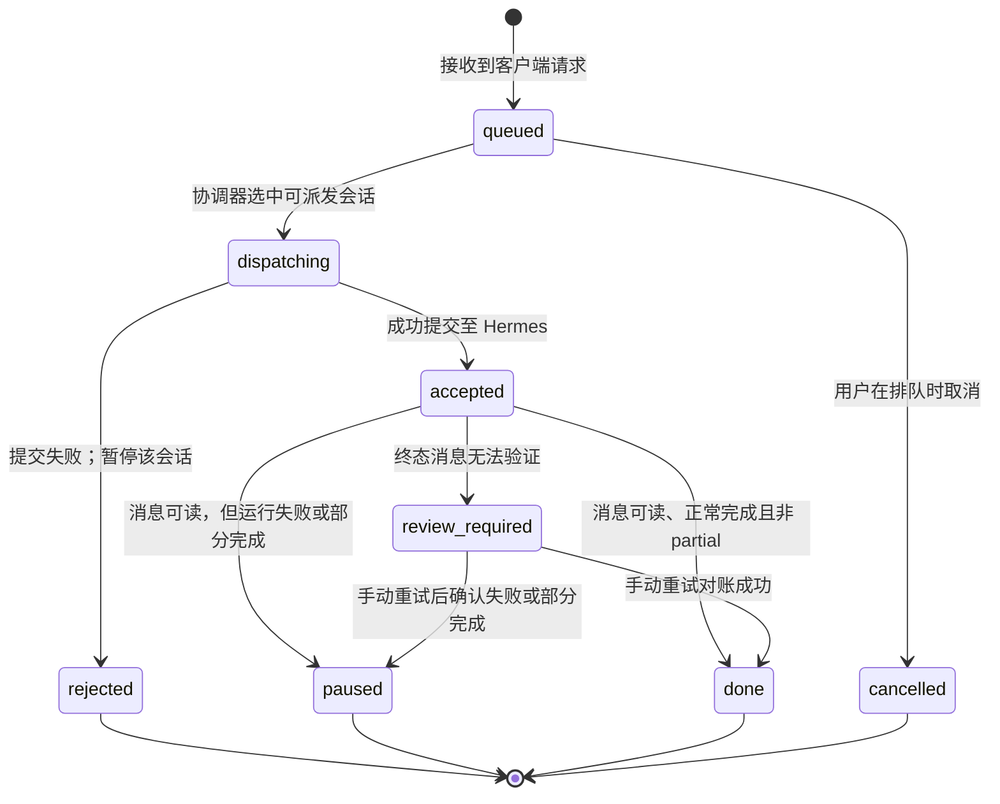
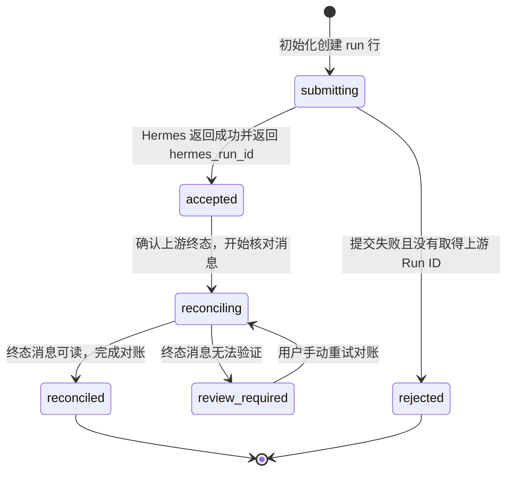
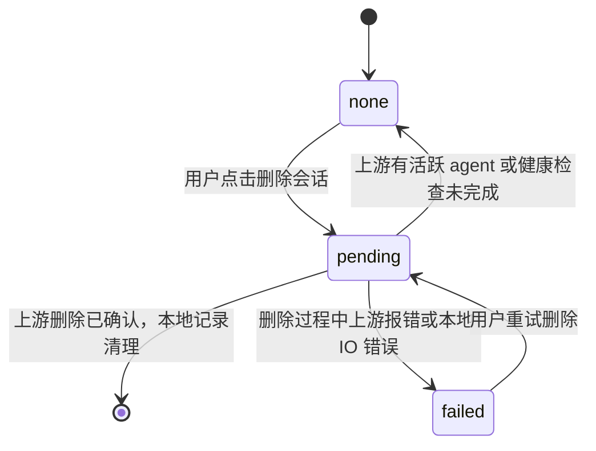

# 状态机机制 (State Machines)

本文档描述 `emu-chat` 系统中各个核心生命周期的流转与状态管理。系统高度依赖状态机确保前后端状态一致性，并通过 SQLite 层面提供严格校验。

## 1. 队列项状态 (QueueItemState)

`queue_items` 表控制每一个用户操作(Operation)在后端的生命周期。

队列项枚举共有 9 种状态，其中 `reconciling` 仍在 Schema 中，但当前协调器不写入该状态；终态对账期间变化的是本地 Run 的状态。工具审批等待体现在 Run 的 `upstream_status = waiting_for_approval`，此时队列项仍是 `accepted`；`review_required` 表示终态对账无法验证。恢复会话队列只解除会话的暂停标记，不把旧的 `paused` 或 `rejected` 项重新入队；这些项的正文可在恢复期限内复制到草稿或丢弃。协调器会跳过暂停、待删除会话的排队项，继续派发其他可运行会话。

## 2. 本地 Run 状态 (RunLocalState)

当 `queue_items` 进入分发态时，会在 `runs` 表中创建一行。它负责追踪单次与上游交互的具体进度。

## 3. 上游 Run 状态 (UpstreamRunStatus)

此状态为 Hermes 上游返回的状态映射，直接缓存于 `runs.upstream_status` 字段中：
1. **queued**: 任务已被 Hermes 接收，处于远端排队。
2. **running**: 模型或工具正在执行。
3. **waiting_for_approval**: 工具调用需要用户人工确认。
4. **stopping**: 用户请求停止，正在安全中止流。
5. **completed**: 上游报告运行结束；是否为部分完成还需看 `partial`。
6. **failed**: 执行遇到系统或模型错误崩溃。
7. **cancelled**: 被主动完全取消。
8. **interrupted**: 被异常中断（如节点重启等）。

## 4. 会话删除状态 (DeleteState)

管理会话删除期间的本地状态。删除请求会先标记 `pending`，再检查上游状态并尝试删除；确认上游删除后，当前请求会清理本地记录。

## 5. 连接状态 (ConnectionStatusHermes)

用于前端状态栏的 Hermes 可用性；Run 的 SSE 连接状态由独立的流事件 Hook 管理：
1. **checking**: 正在探测上游健康接口。
2. **healthy**: 连接正常，版本和鉴权均通过。
3. **degraded**: 健康探测发生非鉴权、非网络类错误，无法确认可用性。
4. **unavailable**: 网络无法连通或 Hermes 宕机。
5. **auth_failed**: 提供的 Token 无效或未授权。
6. **incompatible**: Hermes 健康状态或能力报告不满足必需条件。
7. **config_error**: 服务端未配置 Hermes API Key。

## 6. 暂停原因 (PauseReason)

当 `conversations.queue_paused = 1` 时，由 `pause_reason` 枚举具体说明为何阻断该会话队列的派发；其他会话仍可继续运行。用户可通过恢复队列操作解除暂停。
- **run_failed**: 上游执行报错。
- **run_partial**: 上游将本次运行标记为部分完成。
- **run_cancelled**: 任务被远程或本地取消。
- **run_interrupted**: 上游任务被中断。
- **user_stopped**: 用户手动点击了停止按钮。
- **submission_rejected**: 向 Hermes 提交 Run 时失败，未取得上游 Run ID；原因不限于载荷错误。
- **reconciliation_failed**: 上游 Run 已终止，但终态消息无法验证。
- **review_required**: 枚举保留项，当前服务未写入该暂停原因；终态消息无法验证时写入的是 `reconciliation_failed`。工具审批由 Run 的上游状态表示。
- **manual_resume_required**: 枚举保留项，当前服务未写入该暂停原因。

## 7. 队列项与 Run 状态的联动关系

队列项 (QueueItem) 抽象的是“用户请求”，而 Run 抽象的是“对上游的执行实例”。
- **单向绑定**: 当 QueueItem 进入 `dispatching` 时产生一个 Run 行（`submitting` 态）。
- **同步推进**: 当 Run 从 `submitting` 转为 `accepted` 时，对应的 QueueItem 也从 `dispatching` 变成 `accepted`。审批等待只改变 Run 的上游状态，不会把队列项设为 `review_required`。
- **终态上卷**: 终态消息可读时，`completed` 且非 partial 的 Run 使队列项变为 `done`；失败、取消、中断或 partial 的 Run 使队列项变为 `paused`，并暂停该会话的后续派发。消息无法验证时，Run 和队列项进入 `review_required`，会话以 `reconciliation_failed` 原因暂停。

## 8. 载荷 (payload_text) 生命周期设计

入队项保存待发送的消息正文。为了限制敏感内容留存和 SQLite 占用：
- **必须存在阶段**：`queued`, `dispatching`, `accepted`, `reconciling`。数据库要求这些状态保留消息正文；实际提交发生在 `dispatching` 阶段。
- **必须清空阶段**：`done`, `cancelled`。一旦处于最终静止态，不再有可能被分发，后台业务强制清空此字段（设为 NULL）。
- **失败后恢复阶段**：`paused`, `review_required`, `rejected` 最多保留正文至 `recovery_expires_at`；期限一到，API 立即停止提供正文，后台分批将其清空。
- 这种生命周期由数据库层面的 `CHECK` 约束（详情见 02 数据模型设计）强力保证。

## 9. 状态转换与数据库 CHECK 约束

每当状态机发生迁移，都会被 SQLite 校验：
- 当试图将 `queue_item.state` 更新为 `done` 时，如果应用层忘记 `UPDATE payload_text = NULL`，SQLite 将直接报错，从而保证系统“没有处于结束态却占用巨大存储空间的脏数据”。
- `runs.local_state` 为 `accepted`、`reconciling` 或 `reconciled` 时，`hermes_run_id` 必须非空。外键和 `CHECK` 约束覆盖这些空值与引用关系；其他业务状态转换仍由服务层维护。
