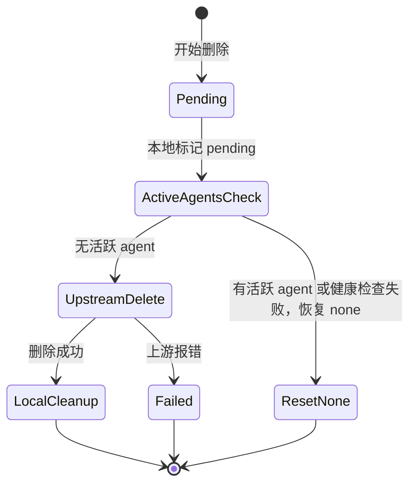
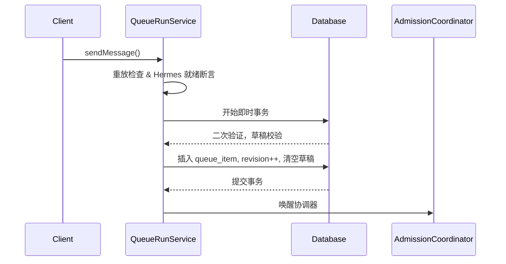
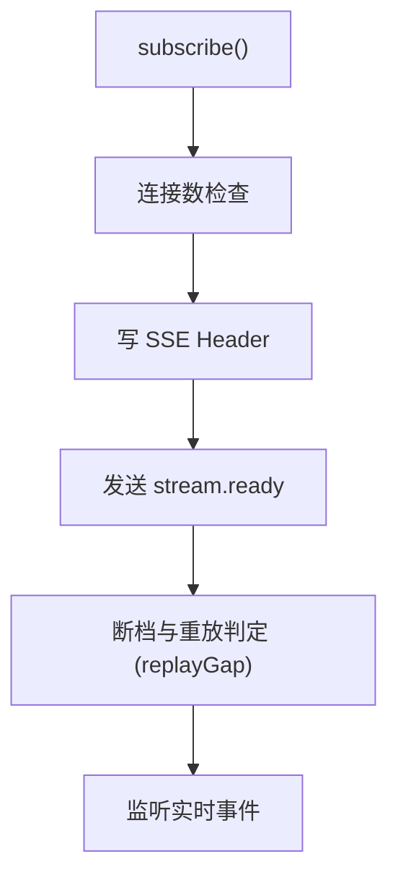

# Server Internals

本文档详细介绍了 Emu-Chat 服务端的内部实现，包括各层业务服务（Services）的设计以及核心系统引擎（Coordinator & SSE Hub）的工作原理。

## 业务服务层

### ConversationService
提供会话级别的生命周期管理与数据操作。

- **listConversations**: 负责遍历本地数据库，与上游 Hermes 同步状态，并通过 `removeMissingLocalConversation` 清理在本地存在但上游已不存在的孤儿会话。
- **getMessages**: 处理消息的读取请求，并在发现会话 ID 不一致时执行 Session ID 自愈（`adoptEffectiveHermesSessionId`）。
- **安全删除流程**:
  1. **前置断言**: 确保会话可以被删除。
  2. **本地标记 pending**: 在本地数据库将状态置为 `pending`。
  3. **上游状态检查**: 确认会话仍存在，并检查 Hermes 的 `active_agents` 是否为 0；若无法完成健康检查或仍有活跃 agent，则恢复本地 `none` 状态。
  4. **上游删除**: 调用 Hermes 接口实际删除。
  5. **本地物理清理/标记 failed**: 删除成功则在本地物理移除，否则回退并标记为 `failed`。
- **fork/reset 操作流程**: `fork` 调用 Hermes 分叉会话，`reset` 创建新的 Hermes 会话；两者都会登记新的本地会话，原会话保持存在。

### DraftPreferencesService
负责管理草稿和用户偏好。
- **UTF-8字节级校验**: 使用 `Buffer.byteLength(content, "utf8")` 检查草稿内容长度。
- **乐观锁保存**: 避免并发写入造成的草稿覆盖。
- **DraftConflictError**: 冲突时抛出相应错误。
- **偏好设置校验**: 对主题枚举、侧边栏宽度范围以及快捷键枚举进行严格校验。

### QueueRunService
负责运行队列和消息投递。
- **sendMessage 原子入队算法**:
  1. 重放检查及 Hermes 就绪断言。
  2. 即时事务开始：二次重放验证，检查删除中状态，确保草稿非空并进行字节校验。
  3. 计算队列深度限制与 FIFO 序号。
  4. 记录正文的 SHA-256 和 UTF-8 字节长度；`client_request_id` 用于提交幂等。
  5. 插入 `queue_item`。
  6. 清空草稿并令 `revision++`。
  7. 唤醒协调器（AdmissionCoordinator）。
- **stopRun / submitApproval 流程**: 提供终止当前运行或提交人工审批的能力。
- **故障载荷恢复**: 
  - `copyToDraft`: 按 `recovery_expires_at` 检查 7 天期限，设置 `overwrite_nonempty` 参数将队列中失败或中断的任务内容写回草稿箱。
  - `discardRecovery`: 丢弃不再需要的恢复载荷。

### DataRetentionService
负责本地数据的到期清理。服务启动时执行一次，之后每分钟执行一次；每次在即时事务中最多清理 100 条到期恢复正文和 100 条过期控制记录。恢复正文清空时写入 `payload_expired_at`；`done`、`cancelled` 控制记录保留 7 天，已过期或主动丢弃正文的 `paused`、`rejected` 记录从最后更新时间起保留 30 天。删除队列项时，关联的终态 Run 由外键级联删除；仍有活跃或待人工处理 Run 的记录不会删除。

### StatusService
- **TTL缓存**: 数据默认在本地缓存 5 秒。
- **Promise单飞复用 (Single-Flight)**: 并发状态请求复用同一个上游探测 Promise；局域网 HTTP 警告在各自响应中补充。
- **主动重检**: `/status/recheck` 跳过缓存重新探测；缺少 API Key 时返回 `config_error`，能力不满足时返回 `incompatible`。

## 核心引擎

### AdmissionCoordinator 准入协调器
负责从队列中拉取任务，派发至外部系统（Hermes）。
- **实例标识**: `ownerId` 基于 `inst_<pid>_<random>` 生成，区分不同节点。
- **启动与崩溃恢复**: 服务启动时将尚未结束的 Run 标记为 `events_truncated`，并在新的事件中心记录 `process_restarted` 缺口，供客户端重连时识别。
- **tick() 2秒轮询循环**:
  执行 `heartbeatLeases`，检查活跃项，调用 `recoverRun` 或 `findNextGlobalQueued` 寻找可用任务进行 `dispatch`。候选查询跳过已暂停或删除状态不为 `none` 的会话，在其余会话中按入队时间取最早项；跳过的任务保留在队列中，恢复会话后重新参与调度。
- **dispatch 双重租约算法**:
  先后获取**全局租约**与**会话租约**，复核任务仍排队、会话未暂停且删除状态为 `none`。成功后状态更新为 `dispatching`，插入 Run 数据并启动 `submit`。
- **submit 提交流程**:
  尝试执行 `startRun`，成功则标记为 `accepted` 并进入 `consume` 流程；失败则标记为 `rejected` 且暂停对应队列。
- **consume SSE消费转发循环**: 建立上游长连接并持续接收结果。
- **reconcileById 权威对账算法**:
  1. 拉取上游最新状态，确认是否为终态。
  2. 验证消息是否可读。
  3. 分支判定：完全成功则标记 `done`；部分成功/失败进入 `paused` 状态，并拥有 7 天恢复窗口；验证失败触发 `review_required`。
- **租约释放与SSE延迟清理**: 安全退出的重要环节，避免僵尸进程和内存泄漏。

### SSEHub 事件广播中枢
负责向前端或下游推送实时事件流。
- **数据结构**: `clients` Map，以及 `streams` Map (存储 `events[]`, `latest_seq`, `dropped_before`, `latest_gap`)。
- **subscribe 订阅流程**:
  检查连接数上限，写入 SSE 响应头。使用 `stream.ready` 控制初始化事件，并在客户端携带的 seq 落后时进行断档与重放判定（`replayGap`）。
- **storeRunEvent 环形缓冲驱逐算法**:
  每个流维持最大 512 条或 1MiB 内存占用。超限时执行 `shift` 淘汰，产生 `buffer_evicted` gap。
- **publishGap 断档通知**: 当发现缺失事件时主动通知客户端。
- **scheduleCleanup 60秒延迟清理**: 终态 Run 短暂保留回放窗口，再用 `unref` 定时器清理其内存事件环。
- **心跳保活**: 每 15 秒向空闲连接发送 heartbeat，防止被网关切断。

