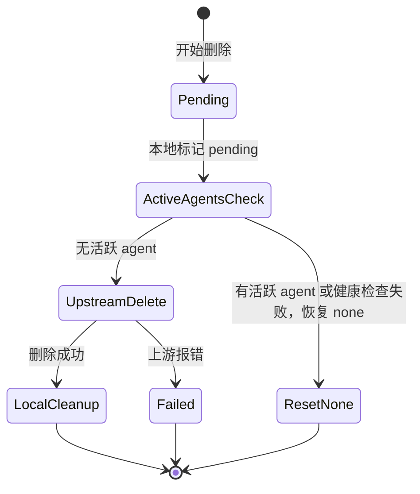
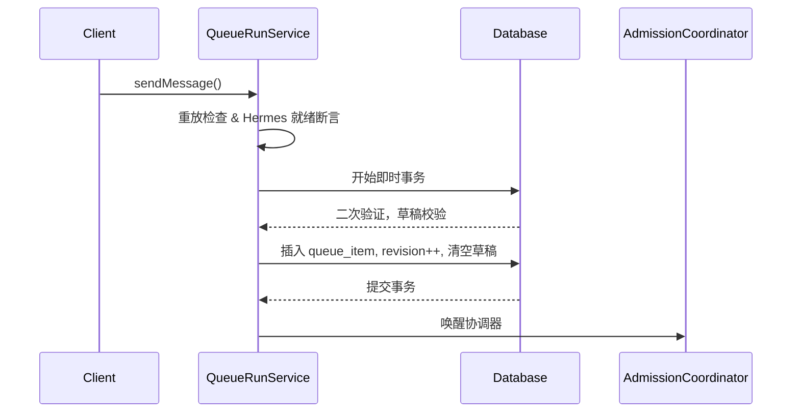
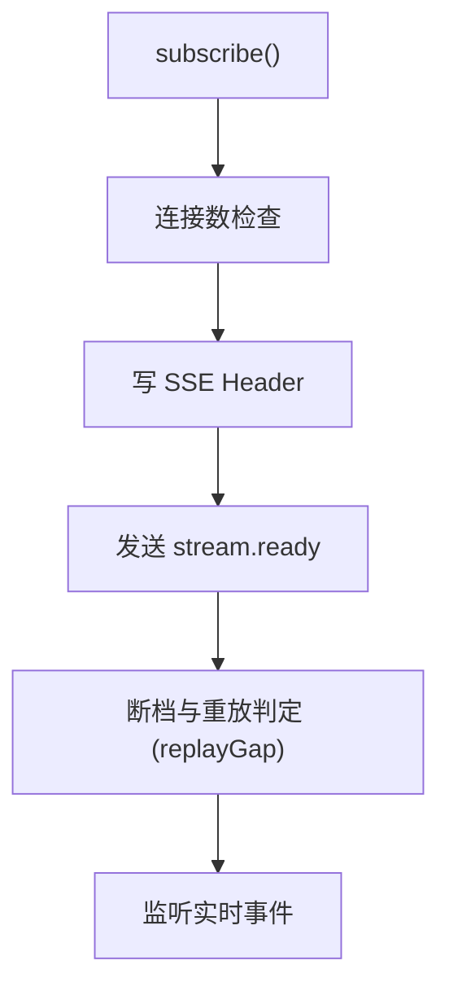

# Server Internals

本文档详细介绍了 Emu-Chat 服务端的内部实现，包括各层业务服务（Services）的设计以及核心系统引擎（Coordinator & SSE Hub）的工作原理。

## 业务服务层

### ConversationService
提供会话级别的生命周期管理与数据操作。

- **listConversations**: 只从本地注册表按 `custom_order ASC, created_at DESC, id ASC` 取得当前页及一条本地前瞻记录；只为当前页读取 Hermes 详情，最多并发 4 个请求。游标保存最后检查的本地排序位置，清理空项甚至删除游标对应记录后仍可继续。不会扫描或导入其他客户端的上游会话。
- **详情读取与自动清理**: 列表及详情读取在上游响应返回后复核 session 映射；映射变化最多按新映射重读一次，避免将旧元数据拼到新映射上。列表收到当前映射的 404 时，在同一即时事务中复核预期 session、`delete_state=none` 和图片分支保护，条件删除成功后才清理 SSE；会话、草稿等级联删除、租约移除和图片 `scope_delete` outbox 共同提交或回滚。`pending`/`failed` 显式删除及待关联图片分支保留本地记录；详情不可读时，列表使用“上游会话不可用”的本地摘要保留删除入口。详见[安全列表与清理决定](../.agents/notes/implemented/bug-fix/2026-10-05-safe-conversation-list-and-cleanup.md)。
- **getMessages**: 处理消息的读取请求，并在发现会话 ID 不一致时执行 Session ID 自愈（`adoptEffectiveHermesSessionId`）。
- **安全删除流程**:
  1. **前置断言**: 确保会话可以被删除。
  2. **本地标记 pending**: 在本地数据库将状态置为 `pending`。
  3. **上游状态检查**: 确认会话仍存在，并检查 Hermes 的 `active_agents` 是否为 0；若无法完成健康检查或仍有活跃 agent，则恢复本地 `none` 状态。
  4. **上游删除**: 调用 Hermes 接口实际删除。
  5. **本地物理清理/标记 failed**: 删除成功则在本地物理移除，否则回退并标记为 `failed`。
- **fork/reset 操作流程**: `fork` 调用 Hermes 分叉会话，`reset` 创建新的 Hermes 会话；两者都会登记新的本地会话，原会话保持存在。

```mermaid
stateDiagram-v2
    [*] --> Pending : 开始删除
    Pending --> ActiveAgentsCheck : 本地标记 pending
    ActiveAgentsCheck --> UpstreamDelete : 无活跃 agent
    ActiveAgentsCheck --> ResetNone : 有活跃 agent 或健康检查失败，恢复 none
    UpstreamDelete --> LocalCleanup : 删除成功
    UpstreamDelete --> Failed : 上游报错
    LocalCleanup --> [*]
    ResetNone --> [*]
    Failed --> [*]
```

### DraftPreferencesService
负责管理草稿和用户偏好。
- **UTF-8字节级校验**: 使用 `Buffer.byteLength(content, "utf8")` 检查草稿内容长度。
- **乐观锁保存**: 避免并发写入造成的草稿覆盖。
- **DraftConflictError**: 冲突时抛出相应错误。
- **偏好设置校验**: 对主题枚举、侧边栏宽度范围以及快捷键枚举进行严格校验。

### QueueRunService
负责运行队列和消息投递。
- **sendMessage 原子入队算法**:
  1. 重放检查及 Hermes 就绪断言。
  2. 即时事务开始：二次重放验证，检查删除中状态，确保草稿非空并进行字节校验。
  3. 计算队列深度限制与 FIFO 序号。
  4. 记录正文的 SHA-256 和 UTF-8 字节长度；`client_request_id` 用于提交幂等。
  5. 插入 `queue_item`。
  6. 清空草稿并令 `revision++`。
  7. 唤醒协调器（AdmissionCoordinator）。
- **stopRun / submitApproval 流程**: 提供 HTTP 入口并调用协调器；Run 状态写入和审批后的对账由协调器处理。
- **故障载荷恢复**: 
  - `copyToDraft`: 按 `recovery_expires_at` 检查 7 天期限，设置 `overwrite_nonempty` 参数将队列中失败或中断的任务内容写回草稿箱。
  - `discardRecovery`: 丢弃不再需要的恢复载荷。

```mermaid
sequenceDiagram
    participant C as Client
    participant QRS as QueueRunService
    participant DB as Database
    participant Coord as AdmissionCoordinator
    
    C->>QRS: sendMessage()
    QRS->>QRS: 重放检查 & Hermes 就绪断言
    QRS->>DB: 开始即时事务
    DB-->>QRS: 二次验证，草稿校验
    QRS->>DB: 插入 queue_item, revision++, 清空草稿
    DB-->>QRS: 提交事务
    QRS->>Coord: 唤醒协调器
```

### DataRetentionService
负责本地数据的到期清理。服务启动时执行一次，之后每分钟执行一次；每次在即时事务中最多清理 100 条到期恢复正文和 100 条过期控制记录。恢复正文清空时写入 `payload_expired_at`；`done`、`cancelled` 控制记录保留 7 天，已过期或主动丢弃正文的 `paused`、`rejected` 记录从最后更新时间起保留 30 天。删除队列项时，关联的终态 Run 由外键级联删除；仍有活跃或待人工处理 Run 的记录不会删除。

### StatusService
- **TTL缓存**: 数据默认在本地缓存 5 秒。
- **Promise单飞复用 (Single-Flight)**: 并发状态请求复用同一个上游探测 Promise；局域网 HTTP 警告在各自响应中补充。
- **主动重检**: `/status/recheck` 跳过缓存重新探测；缺少 API Key 时返回 `config_error`，能力不满足时返回 `incompatible`。

## 核心引擎

### AdmissionCoordinator 准入协调器
负责从队列中拉取任务，派发至外部系统（Hermes）。
- **实例标识**: `ownerId` 基于 `inst_<pid>_<random>` 生成，区分不同节点。
- **启动与崩溃恢复**: 服务启动时将尚未结束的 Run 标记为 `events_truncated`，并在新的事件中心记录 `process_restarted` 缺口，供客户端重连时识别。
- **tick() 2秒轮询循环**:
  执行 `heartbeatLeases`，检查活跃项；无上游 ID 时执行 `recoverSubmitting`，有上游 ID 时执行 `recoverRun`，否则通过 `findNextGlobalQueued` 寻找可用任务。租约另有独立的 5 秒续期定时器，避免上游读请求阻塞派发 tick 时租约过期。候选查询跳过已暂停或删除状态不为 `none` 的会话，在其余会话中按入队时间取最早项。
- **dispatch 双重租约算法**:
  先后获取**全局租约**与**会话租约**，在即时事务中复核令牌、任务与会话状态，并原子地将队列项改为 `dispatching`、插入 `submitting` Run。事务失败时两项均回滚；上游调用在提交之后开始。
- **submit 提交流程**:
  `startRun` 成功后，在即时事务中将 Run 与队列项共同改为 `accepted`，随后消费 SSE。提交前失败或 Hermes 明确返回鉴权失败、会话不存在时，Run 与队列项共同进入 `rejected`，会话暂停。超时、网络断开或响应格式错误等结果不明的情况保留 `submitting` / `dispatching`，不换幂等键；同一进程用 `submitFlights` 防止并发提交同一 Run。
- **提交恢复与人工核对**:
  首次派发持久化 `dispatch_session_id`、正文、幂等键及 24 小时截止时间。重启后在有效窗口内用完全相同的请求重放，最多尝试 4 次，失败后等待 5、10、20 秒。第四次仍无法确认或截止时间已过时，原子地将 Run 与队列项改为 `review_required`、会话以 `manual_resume_required` 暂停，发出 `run.review_required`，释放租约和全局槽位。没有上游 ID 的记录只能由用户检查 Hermes 历史后手动恢复后续队列；原正文仍按 7 天恢复规则保留。
- **consume SSE消费转发循环**: 建立上游长连接并持续接收结果。
- **reconcileById 权威对账算法**:
  1. 所有定时轮询、SSE 消费结束、审批后和手动对账请求按本地 Run ID 合并进行中的调用。
  2. 拉取 Hermes 状态后，在即时事务中复核当前状态和活跃租约；旧的非终态响应不能覆盖已记录的终态。
  3. 终态时验证消息可读，再复核状态、`partial` 与租约，并在一个事务内更新 Run、队列项及会话暂停状态。完全成功进入 `done`，失败或部分完成进入 `paused`，消息无法验证进入 `review_required`。成功只清除本次核对失败产生的自动暂停；各分支都保留已提交的 `user_stopped`，不会因停止与完成竞态或历史重试而继续派发。提交后再发 `run.reconciled` 或 `run.paused` 通知并释放租约。
- **停止与审批**: `stopRun` 在事务中更新上游状态缓存及 `user_stopped` 会话暂停标记，随后请求 Hermes 停止。停止请求失败或结果不明不回滚暂停，Run 继续按上游真实状态对账，后续消息等待用户显式恢复。`submitApproval` 核验上游当前审批，在发送选择后只在 Run 仍处于同一待审批状态时写回 `running`，再通过统一对账入口刷新终态。
- **租约释放与SSE延迟清理**: 安全退出的重要环节，避免僵尸进程和内存泄漏。

### SSEHub 事件广播中枢
负责向前端或下游推送实时事件流。
- **数据结构**: `clients` Map，以及 `streams` Map (存储 `events[]`, `latest_seq`, `dropped_before`, `latest_gap`)。
- **subscribe 订阅流程**:
  检查连接数上限，写入 SSE 响应头。使用 `stream.ready` 控制初始化事件，并在客户端携带的 seq 落后时进行断档与重放判定（`replayGap`）。
- **storeRunEvent 环形缓冲驱逐算法**:
  每个流维持最大 512 条或 1MiB 内存占用。超限时执行 `shift` 淘汰，产生 `buffer_evicted` gap。
- **publishGap 断档通知**: 当发现缺失事件时主动通知客户端。
- **scheduleCleanup 60秒延迟清理**: 终态 Run 短暂保留回放窗口，再用 `unref` 定时器清理其内存事件环。
- **心跳保活**: 每 15 秒向空闲连接发送 heartbeat，防止被网关切断。

```mermaid
flowchart TD
    Sub["subscribe()"] --> CheckLimits["连接数检查"]
    CheckLimits --> WriteHeader["写 SSE Header"]
    WriteHeader --> StreamReady["发送 stream.ready"]
    StreamReady --> ReplayCheck["断档与重放判定 (replayGap)"]
    ReplayCheck --> ListenEvents["监听实时事件"]
```
