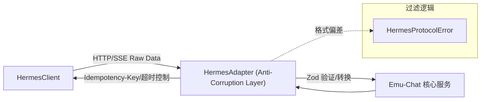
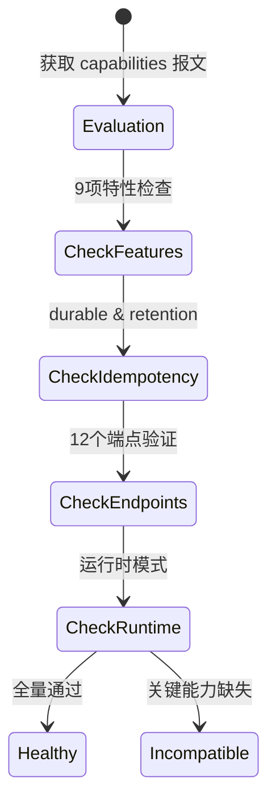

# Hermes Integration

本文档阐述 Emu-Chat 接入核心上游服务 Hermes 的网络层与协议适配层设计。

## HermesClient 底层HTTP/SSE客户端

`HermesClient` 负责与 Hermes 的直接 HTTP 以及 SSE (Server-Sent Events) 通信。

- **鉴权注入**: 每个请求自动注入 Bearer Token 并在必要时显式删除 `X-Hermes-Session-Key` 头以适配身份切换等操作。
- **request<T> 管道**:
  1. `isConfigured` 检查，确保基础 URL 和认证配置有效。
  2. URL 拼接与构建。
  3. 挂载 `AbortController` 控制请求超时。
  4. `readBoundedText` 在 `Content-Length` 超限时提前拒绝；其他响应读取完整正文后再按 UTF-8 字节数检查 4 MiB，上游未声明长度时没有逐块限流。
  5. 经过 `throwForStatus` 的状态码映射，转换为特定业务异常（如 `HermesNotFoundError`、`HermesAuthFailedError`）。
- **stream SSE管道**:
  - **握手超时**: 限制 10s 内必须完成连接。
  - **readSseChunk竞速**: 利用 `Promise.race` 检查网络活跃度（Liveness 保活上限 30s）。
  - **行解析状态机**: `HermesClient` 自行按行增量解析 SSE 帧。
  - **接收缓冲限制**: 每次读取 chunk 后、分行前检查当前字符串缓冲区是否超过 256 KiB；当前实现并未累计限制多行组成的整帧大小。
  - **输出**: 解析完成即 `yield HermesSseEvent` 对象供外层使用。

## HermesAdapter 协议适配器（反腐层 Anti-Corruption Layer）

`HermesAdapter` 作为系统的反腐层，屏蔽上游协议的脏细节，输出强类型及领域模型。

- **getDetailedHealth**: 组合式探活，合并调用 `/health/detailed` 与 `/v1/capabilities` 双端点确认整体存活及能力详情。
- **assertReady**: 将健康状态评估与能力是否符合预期的检查进行组合校验，只有两项均过关才判定为 Ready。
- **会话管理API映射**: 包装了针对 Hermes session 相关的各种调用（`getSession`, `createSession`, `updateSession`, `forkSession`, `deleteSession`）。
- **startRun**: 发起运行调用。内部限制请求超时 30 秒，并附加 `Idempotency-Key` 标头以防止网络抖动导致的重复执行。
- **getRunStatus**: 拉取状态信息，并对获取到的 `run_id` 实施强一致性校验。
- **streamEvents**: 异步迭代器接口，负责将来自 Client 的纯净流进行转换。逐帧校验 JSON 格式、对比 `run_id` 确保不错乱，并验证 timestamp 合法性。
- **normalizeSession**: 日期格式标准化处理。将上游返回的秒级 Unix 时间戳转换为内部统一使用的 ISO 8601 字符串格式。
- **协议校验 (Zod Schema)**: 会话、健康、消息和 Run 等需要读取结构化数据的响应经过 Schema 解析或字段校验；删除、停止和审批等无数据响应不做同样的结构验证。格式偏差会抛出 `HermesProtocolError`。

## evaluateHermesCapabilities 能力评估函数

该函数专门用于解析 `/v1/capabilities` 返回的数据并形成综合评估报告。

- **9项特性检查**: 确认诸如 `run_submission` 等是否得到上游支持。
- **幂等性检查**: 判断是否支持 `durable`，且要求 `retention_seconds >= 86400`（即至少24小时保留）。
- **端点存在性验证**: 预定义 12 个关键端点，依次校验是否存在于声明中。
- **运行时模式检查**: 验证是否具备 `server_agent` 及 `server tool_execution` 权限。
- **评估结果**: 能力完整时返回 `healthy`，缺少必需条件时返回 `incompatible`。网络、鉴权和其他探测错误由 `StatusService` 捕获并映射到连接状态，不由此函数分类。

