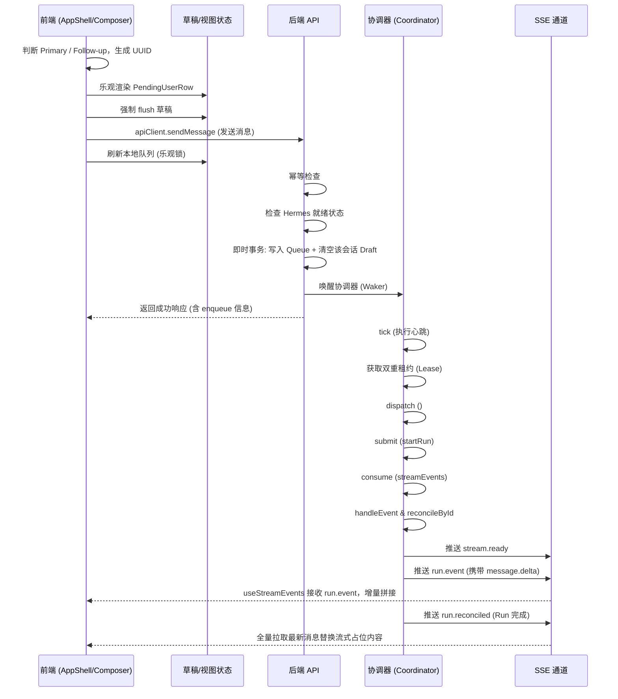
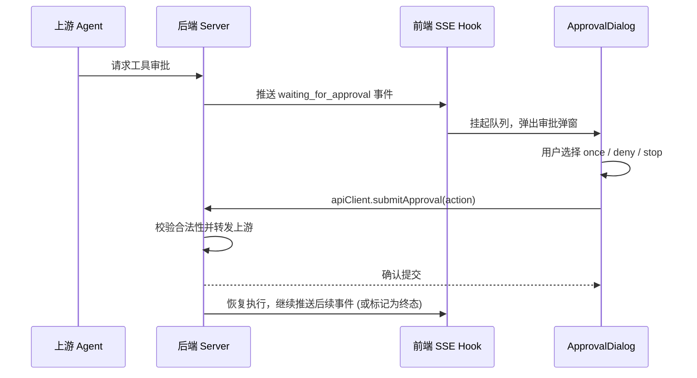
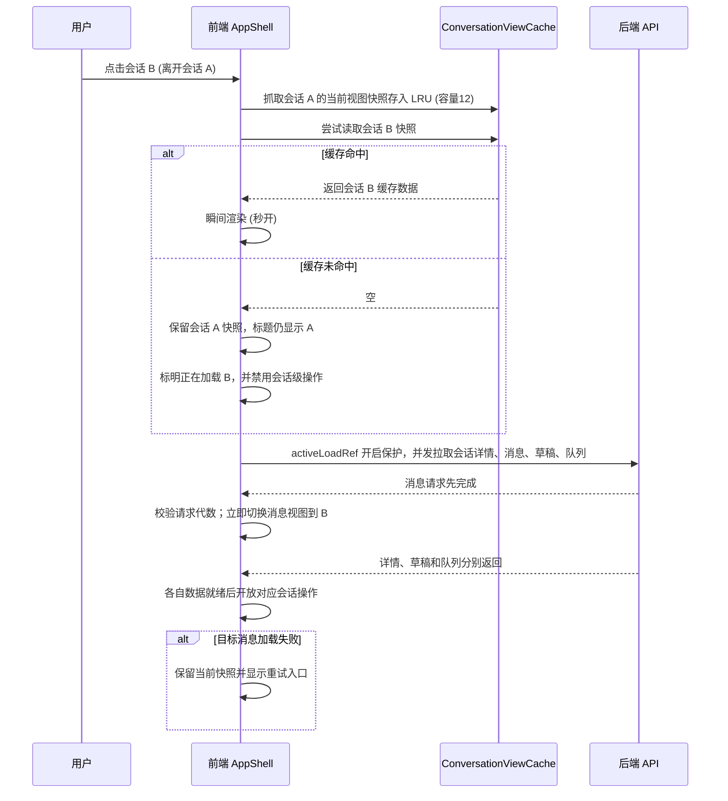
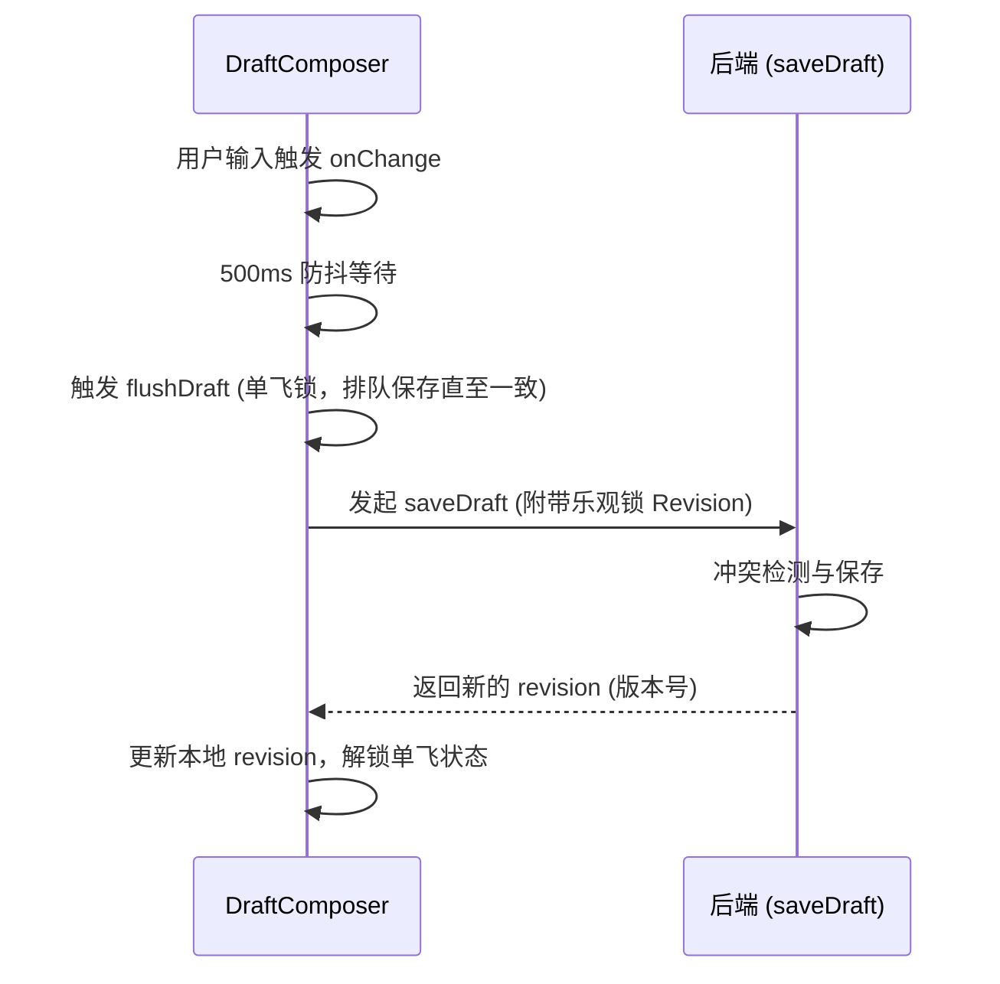
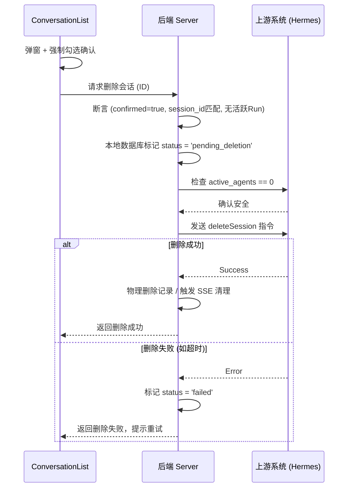
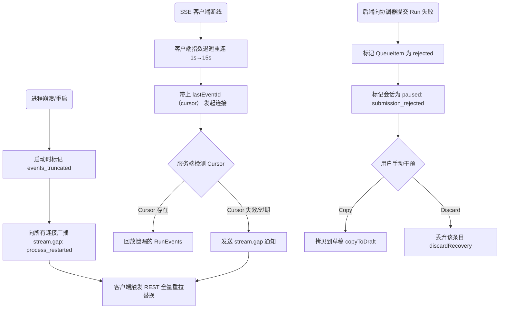
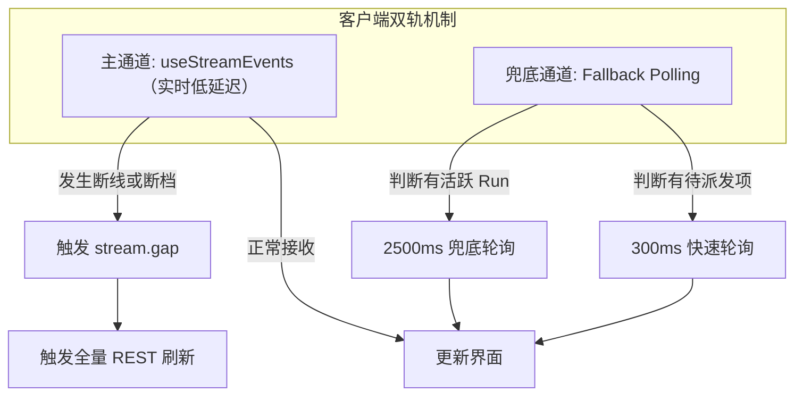

# Emu Chat 数据流图

本文档通过 Mermaid 序列图详细描述了 Emu Chat 的核心业务数据流转与异常处理流程。

## 1. 消息发送完整流程（Primary 消息 vs Follow-up 消息）

无论是发送 Primary（主干）消息，还是后续追加的 Follow-up 消息，前后端协同的整体数据流如下：

## 2. 工具审批流程

当后台 Agent 需要调用高危或受限工具时，将触发审批交互：

## 3. 会话切换与 LRU 秒开机制

客户端为了保证切换的极速体验，采用了 LRU 缓存：

首次打开且没有可保留的旧视图时，消息区显示加载状态。缓存命中时先恢复快照，再后台刷新目标会话。

## 4. 草稿同步流程

为防止用户输入丢失，客户端会自动同步草稿状态：

## 5. 会话删除两阶段流程

为了保证分布式架构下的数据安全，删除动作分为本地标记和上游物理删除两步：

## 6. 故障恢复流程

针对服务崩溃、断网等情况，提供完善的恢复机制：

## 7. SSE 事件流双轨容灾

在事件推送机制上，系统设计了双轨模型以防止卡死：

