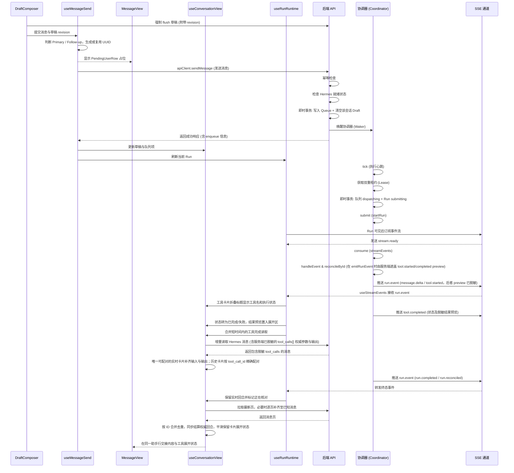
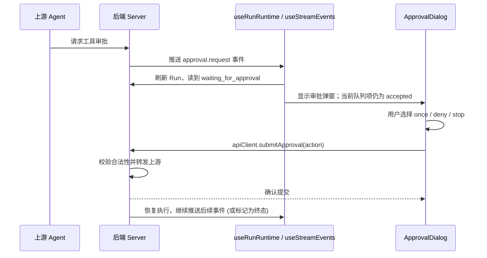
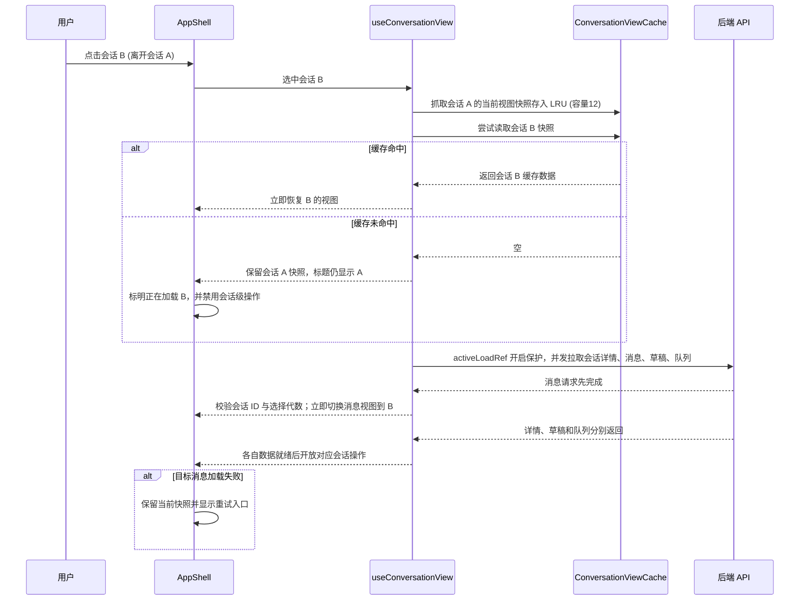
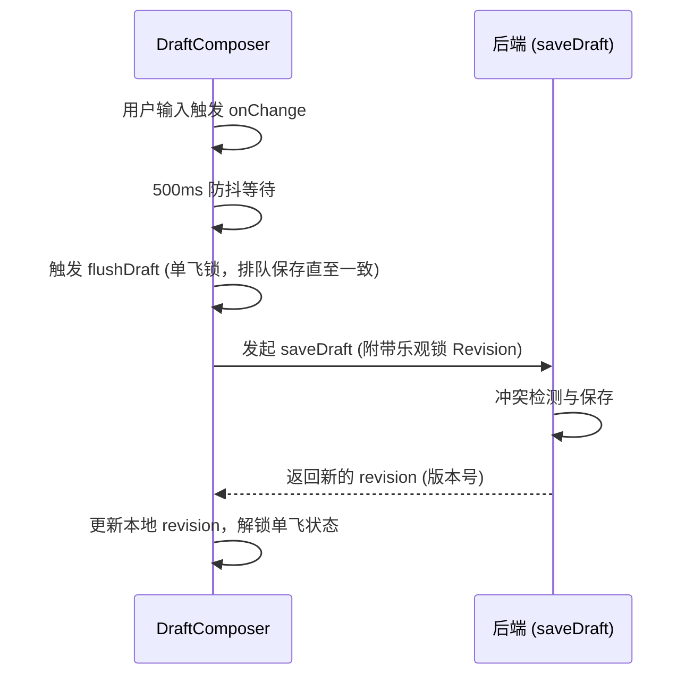
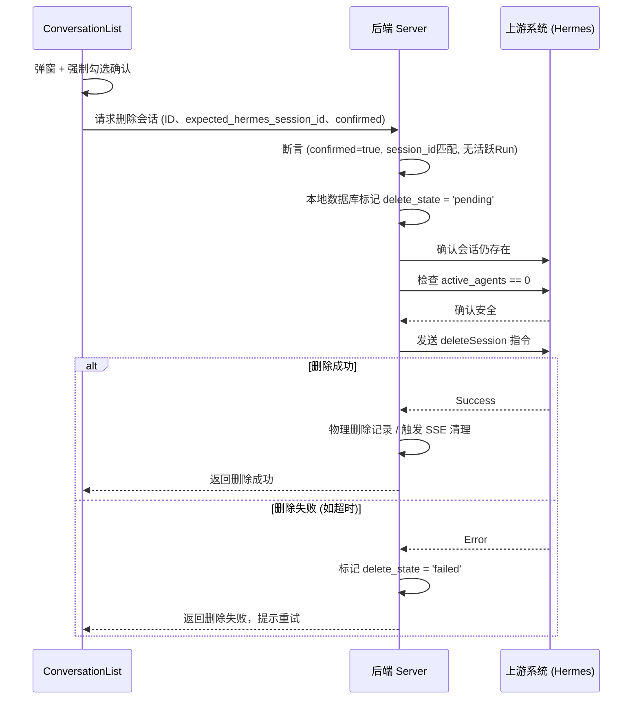
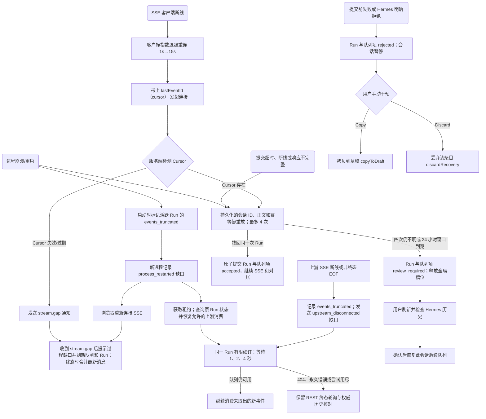
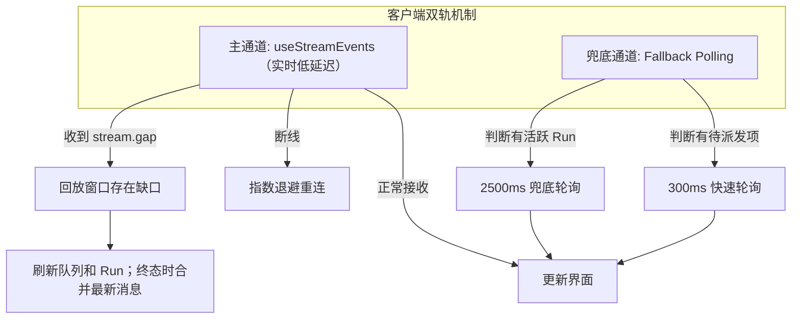
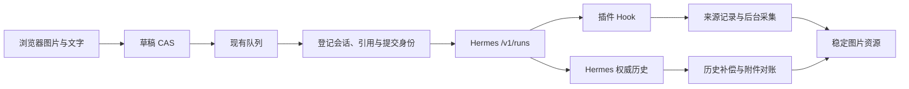

# Emu Chat 数据流图

本文档通过 Mermaid 序列图详细描述了 Emu Chat 的核心业务数据流转与异常处理流程。

## 1. 消息发送完整流程（Primary 消息 vs Follow-up 消息）

无论是发送 Primary（主干）消息，还是后续追加的 Follow-up 消息，前后端协同的整体数据流如下：

```mermaid
sequenceDiagram
    participant Composer as DraftComposer
    participant Send as useMessageSend
    participant Messages as MessageView
    participant View as useConversationView
    participant Runtime as useRunRuntime
    participant API as 后端 API
    participant Coord as 协调器 (Coordinator)
    participant SSE as SSE 通道

    Composer->>API: 强制 flush 草稿 (附带 revision)
    Composer->>Send: 提交消息与草稿 revision
    Send->>Send: 判断 Primary / Follow-up，生成或复用 UUID
    Send-->>Messages: 显示 PendingUserRow 占位
    Send->>API: apiClient.sendMessage (发送消息)
    
    API->>API: 幂等检查
    API->>API: 检查 Hermes 就绪状态
    API->>API: 即时事务: 写入 Queue + 清空该会话 Draft
    API->>Coord: 唤醒协调器 (Waker)
    API-->>Send: 返回成功响应 (含 enqueue 信息)
    Send->>View: 更新草稿与队列项
    Send->>Runtime: 刷新当前 Run

    Coord->>Coord: tick (执行心跳)
    Coord->>Coord: 获取双重租约 (Lease)
    Coord->>Coord: 即时事务: 队列 dispatching + Run submitting
    Coord->>Coord: submit (startRun)
    Runtime->>SSE: Run 可见后订阅事件流
    SSE-->>Runtime: 发送 stream.ready
    Coord->>Coord: consume (streamEvents)
    Coord->>Coord: handleEvent & reconcileById (在 emitRunEvent 时由服务端遮盖 tool.started/completed preview)

    Coord->>SSE: 推送 run.event (message.delta / tool.started，后者 preview 已脱敏)
    SSE-->>Runtime: useStreamEvents 接收 run.event
    Runtime->>View: 工具卡片折叠标题显示工具名和执行状态
    Coord->>SSE: 推送 tool.completed (状态及脱敏结果预览)
    Runtime->>View: 状态转为已完成/失败，结果预览置入展开区
    Runtime->>View: 合并短时间内的工具完成读取
    View->>API: 增量读取 Hermes 消息 (含服务端已脱敏的 tool_calls[] 权威参数与输出)
    API-->>View: 返回包含脱敏 tool_calls 的消息
    View->>View: 唯一可配对的实时卡片补齐输入与输出；历史卡片按 tool_call_id 精确配对
    Coord->>SSE: 推送 run.event (run.completed / run.reconciled)
    SSE-->>Runtime: 转发终态事件
    Runtime->>View: 保留实时回合并标记正在核对
    View->>API: 拉取最新页，必要时逐页补齐至已知消息
    API-->>View: 返回消息页
    View->>View: 按 ID 合并去重，同步结算权威回合，平滑保留卡片展开状态
    View-->>Messages: 在同一助手行交接内容与工具展开状态
```

## 2. 工具审批流程

当后台 Agent 需要调用高危或受限工具时，将触发审批交互：

```mermaid
sequenceDiagram
    participant Agent as 上游 Agent
    participant Backend as 后端 Server
    participant SSE as useRunRuntime / useStreamEvents
    participant Dialog as ApprovalDialog

    Agent->>Backend: 请求工具审批
    Backend->>SSE: 推送 approval.request 事件
    SSE->>Backend: 刷新 Run，读到 waiting_for_approval
    SSE->>Dialog: 显示审批弹窗；当前队列项仍为 accepted
    Dialog->>Dialog: 用户选择 once / deny / stop
    Dialog->>Backend: apiClient.submitApproval(action)
    Backend->>Backend: 校验合法性并转发上游
    Backend-->>Dialog: 确认提交
    Backend->>SSE: 恢复执行，继续推送后续事件 (或标记为终态)
```

## 3. 会话切换与 LRU 秒开机制

客户端为了保证切换的极速体验，采用了 LRU 缓存：

```mermaid
sequenceDiagram
    participant User as 用户
    participant AppShell as AppShell
    participant View as useConversationView
    participant Cache as ConversationViewCache
    participant API as 后端 API

    User->>AppShell: 点击会话 B (离开会话 A)
    AppShell->>View: 选中会话 B
    View->>Cache: 抓取会话 A 的当前视图快照存入 LRU (容量12)
    View->>Cache: 尝试读取会话 B 快照
    
    alt 缓存命中
        Cache-->>View: 返回会话 B 缓存数据
        View-->>AppShell: 立即恢复 B 的视图
    else 缓存未命中
        Cache-->>View: 空
        View-->>AppShell: 保留会话 A 快照，标题仍显示 A
        AppShell->>AppShell: 标明正在加载 B，并禁用会话级操作
    end

    View->>API: activeLoadRef 开启保护，并发拉取会话详情、消息、草稿、队列
    API-->>View: 消息请求先完成
    View-->>AppShell: 校验会话 ID 与选择代数；立即切换消息视图到 B
    API-->>View: 详情、草稿和队列分别返回
    View-->>AppShell: 各自数据就绪后开放对应会话操作
    alt 目标消息加载失败
        AppShell->>AppShell: 保留当前快照并显示重试入口
    end
```

首次打开且没有可保留的旧视图时，消息区显示加载状态。缓存命中时先恢复快照，再后台刷新目标会话。

发送、Run 轮询、操作回调和 SSE 展示写入都携带视图捕获的 `ViewTarget`；状态所有者核对会话 ID 与选择代数，旧 A 请求即使在 A → B → A 后返回，也不能覆盖第二次 A 的视图。Queue 快照另核对请求开始时的本地版本；Run 结果核对身份、更新时间与终态。重命名和置顶属于已提交的后台变更：成功后按字段更新目标会话及其缓存，再刷新会话列表，不用异步开始时的整份详情覆盖当前会话。

消息首次加载请求最新的 100 条并按 ID 升序展示；顶部按钮依据单独缓存的最早消息 ID 与 `latest` offset 加载更早历史。终态对账或缓存刷新从最新页逐页补齐至已加载消息，翻页时通过重叠页适应新消息插入造成的 offset 移动。详见[消息分页修正决定](../.agents/notes/implemented/bug-fix/2026-09-24-correct-message-pagination.md)。

## 4. 草稿同步流程

为防止用户输入丢失，客户端会自动同步草稿状态：

```mermaid
sequenceDiagram
    participant Composer as DraftComposer
    participant API as 后端 (saveDraft)

    Composer->>Composer: 用户输入触发 onChange
    Composer->>Composer: 500ms 防抖等待
    Composer->>Composer: 触发 flushDraft (单飞锁，排队保存直至一致)
    Composer->>API: 发起 saveDraft (附带乐观锁 Revision)
    API->>API: 冲突检测与保存
    API-->>Composer: 返回新的 revision (版本号)
    Composer->>Composer: 更新本地 revision，解锁单飞状态
```

上述流程同时适用于手工输入和空状态建议卡片。建议卡片把文本交给 `DraftComposer` 后进入同一防抖、单飞保存队列；直接发送会先等待 `flushDraft` 完成，再以最新草稿 revision 入队。保存失败时保留文本并停止发送，详见[建议卡片草稿修正决定](../.agents/notes/implemented/bug-fix/2026-09-24-save-prompt-starter-draft.md)。

## 5. 会话删除两阶段流程

为了保证分布式架构下的数据安全，删除动作分为本地标记和上游物理删除两步：

```mermaid
sequenceDiagram
    participant UI as ConversationList
    participant API as 后端 Server
    participant Upstream as 上游系统 (Hermes)

    UI->>UI: 弹窗 + 强制勾选确认
    UI->>API: 请求删除会话 (ID、expected_hermes_session_id、confirmed)
    
    API->>API: 断言 (confirmed=true, session_id匹配, 无活跃Run)
    API->>API: 本地数据库标记 delete_state = 'pending'
    API->>Upstream: 确认会话仍存在
    API->>Upstream: 检查 active_agents == 0
    Upstream-->>API: 确认安全
    API->>Upstream: 发送 deleteSession 指令
    
    alt 删除成功
        Upstream-->>API: Success
        API->>API: 物理删除记录 / 触发 SSE 清理
        API-->>UI: 返回删除成功
    else 删除失败 (如超时)
        Upstream-->>API: Error
        API->>API: 标记 delete_state = 'failed'
        API-->>UI: 返回删除失败，提示重试
    end
```

若健康检查失败或发现上游有活跃 agent，服务会撤销本地 `pending` 标记；若上游会话已不存在，则直接完成本地清理。

## 6. 故障恢复流程

针对服务崩溃、断网等情况，提供完善的恢复机制：

```mermaid
flowchart TD
    Crash(进程崩溃/重启) --> MarkTruncate[启动时标记活跃 Run 的 events_truncated]
    MarkTruncate --> NewHub[新进程记录 process_restarted 缺口]
    NewHub --> Reconnect[浏览器重新连接 SSE]
    NewHub --> RecoverRun[获取租约；查询原 Run 状态并恢复允许的上游消费]
    Reconnect --> ClientREST[收到 stream.gap 后提示过程缺口并刷新队列和 Run；终态时合并最新消息]

    NetDrop(SSE 客户端断线) --> ExpBackoff[客户端指数退避重连 1s→15s]
    ExpBackoff --> SendCursor[带上 lastEventId （cursor） 发起连接]
    SendCursor --> ServerReplay{服务端检测 Cursor}
    ServerReplay -- Cursor 存在 --> Replay[回放遗漏的 RunEvents]
    ServerReplay -- Cursor 失效/过期 --> ReplyGap[发送 stream.gap 通知]
    ReplyGap --> ClientREST

    UpstreamDrop[上游 SSE 断线或非终态 EOF] --> UpstreamGap[记录 events_truncated；发送 upstream_disconnected 缺口]
    UpstreamGap --> RetryStream[同一 Run 有限续订：等待 1、2、4 秒]
    RetryStream -- 队列仍可用 --> FreshEvents[继续消费未取出的新事件]
    RetryStream -- 404、永久错误或尝试用尽 --> PollRun[保留 REST 终态轮询与权威历史核对]
    RecoverRun --> RetryStream

    Unknown(提交超时、断线或响应不完整) --> Replay[持久化的会话 ID、正文和幂等键重放；最多 4 次]
    Crash --> Replay
    Replay -- 找回同一次 Run --> Accepted[原子提交 Run 与队列项 accepted，继续 SSE 和对账]
    Replay -- 四次仍不明或 24 小时窗口到期 --> Review[Run 与队列项 review_required；释放全局槽位]
    Review --> History[用户刷新并检查 Hermes 历史]
    History --> Resume[确认后恢复此会话后续队列]
    ExplicitFail(提交前失败或 Hermes 明确拒绝) --> Rejected[Run 与队列项 rejected；会话暂停]
    Rejected --> UserAction{用户手动干预}
    UserAction -- Copy --> CopyDraft[拷贝到草稿 copyToDraft]
    UserAction -- Discard --> DiscardItem[丢弃该条目 discardRecovery]
```

结果不明的旧队列项不会自动重发为新任务。人工恢复队列只解除会话暂停；如确需重新提交原文，应先检查 Hermes 历史，并在 7 天恢复期内复制到草稿后由用户重新发送。

用户停止时先提交 `user_stopped`，再发送上游停止请求。上游可能在同一时间正常完成；此时 Run 如实对账为成功，后续队列仍暂停。失败的停止响应也不解除暂停。客户端在 `run.paused` 或 `run.reconciled` 后刷新状态并交接历史，暂停中的待发消息全部可见；没有真实执行或未完成历史交接时，不进行执行轮询。复制恢复正文通过输入框的单飞保存和草稿 CAS，保留当前输入及会话切换保护。

上游消费恢复与浏览器 SSE 回放分别处理。当前 Hermes 的一次性队列没有事件游标或重放，断线后可能已删除队列；有限续订只取仍可用的新事件，缺失过程保留提示。有效租约保证单 Run 至多一个有效消费者；终态、租约丢失和服务关闭取消上游读取及重连计时器。仅请求停止不会取消终态确认，也不会清空实时展示；历史延迟时继续保留内容及展开状态。

## 7. SSE 事件流双轨容灾

在事件推送机制上，系统设计了双轨模型以防止卡死：

```mermaid
graph TD
    subgraph 客户端双轨机制
        SSE[主通道: useStreamEvents （实时低延迟）] 
        Poll[兜底通道: Fallback Polling]
    end

    SSE -->|正常接收| UI[更新界面]
    SSE -->|断线| Reconnect[指数退避重连]
    SSE -->|收到 stream.gap| Gap[回放窗口存在缺口]
    Gap --> FullSync[刷新队列和 Run；终态时合并最新消息]
    
    Poll -->|判断有待派发项| FastPoll[300ms 快速轮询]
    Poll -->|判断有活跃 Run| SlowPoll[2500ms 兜底轮询]
    
    FastPoll --> UI
    SlowPoll --> UI
```

## 8. 图片工作流与恢复

```mermaid
flowchart LR
  Browser[浏览器图片与文字] --> Draft[草稿 CAS]
  Draft --> Queue[现有队列]
  Queue --> Bind[登记会话、引用与提交身份]
  Bind --> Run[Hermes /v1/runs]
  Run --> Hook[插件 Hook]
  Hook --> Capture[来源记录与后台采集]
  Capture --> Asset[稳定图片资源]
  Run --> History[Hermes 权威历史]
  History --> Reconcile[历史补偿与附件对账]
  Reconcile --> Asset
```

上传成功后如果草稿保存冲突，图片仍保留在当前会话，用户可重试加入草稿。Run 派发一旦开始，完整输入被冻结；网络重试沿用同一个 operation 和幂等键。工具输出与图片保存是两个状态，重试采集不会新建 Run。会话压缩后登记有效 session 别名；分支只继承已复制消息的图片引用。删除先阻止新引用，持久化插件 scope 删除任务，待所有引用解除后延迟清理原文件。
